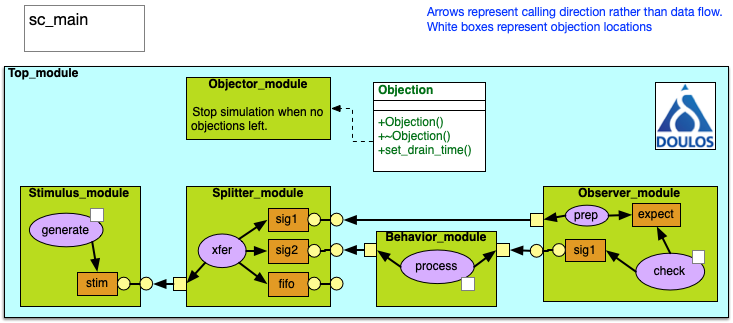

<!-- For doxygen -->
\mainpage

About Basic SystemC Debugging
=============================

This is a simple SystemC design illustrating features related to incorporating reporting and waveform tracing into your simulations. Simulations complete with a simple PASSED/FAILED indicator.

Features
--------

The following are features demonstrated in this code.

- An extended reporting mechanism to simplify `SC_REPORT_*`. See report.hpp
- Use of command-line arguments to specify tracing and debugging. See commandline.hpp and top.cpp:23
- Adding tracing of signals from within each module. See top.cpp:52 and stimulus.cpp:23
- Generic signal splitter the replicates input to multiple destinations. See splitter.hpp
- UVM-like objections controls when to stop. See objection.hpp.
- `sc_main` detects lack of `sc_stop()` and corrects. See main.cpp:51
- `sc_main` displays statistics and success/failure before exiting. See main.cpp:57
- Use of tlm_fifo<T> to capture data
- Determining if an export is connected. See splitter.hpp:65 is_connected() function.
- Modern C++ features: Uniform initialization, class inline static variables, ranged-for, auto, raw-strings, user-define literals
  
Non-features
------------

The following are not supported in this project.

- TLM-2.0

Requirements
------------
- SystemC 2.3.2 or better
- C++17 or better

Block diagram
-------------



Functional Description
----------------------

The design is a trivial SystemC implementation of stimulus, process and verify. The goal is to illustrate features of SystemC and use some modern C++.

Stimulus generates random data. The splitter duplicates the data stream for use by the behavior (e.g. design under test) and observer (checker). The behavior does a trivial transformation (twiddles bits) with an option to inject errors. The observer compares against expected.

See help in main.cpp:25 for run-time options.

How to run
----------

```sh
% make exe
% ./run.x -help
% ./run.x
% ./run.x -trace
% ./run.x -debug=stimulus -debug=splitter
% ./run.x -debugall -trace
```

Files
-----

| Filename              | Purpose                                                                                             |
| --------------------- | --------------------------------------------------------------------------------------------------- |
| `.gdbinit`            | Contains GDB macros to suppress parts of SystemC when debugging                                     |
| `Makefile`            | Specifies files to compile if using make                                                            |
| `README.md`           | This documentation in markdown                                                                      |
| `behavior.cpp`        | "Processing" module                                                                                 |
| `behavior.hpp`        | `Behavior_module` header                                                                            |
| `commandline.hpp`     | Simple interface to determine if command-line option present.                                       |
| `common.hpp`          | Shared constants.                                                                                   |
| `main.cpp`            | Slightly more sophisticated main.                                                                   |
| `objection.hpp`       | Provides mechanism similar to UVM objections.                                                       |
| `observer.cpp`        | Compares results to expected data.                                                                  |
| `observer.hpp`        | `Observer_module` header                                                                            |
| `report.hpp`          | Convenience macros for reporting errors, info and debug.                                            |
| `sc_time_literal.hpp` | Allows natural representaion of `sc_time` (e.g. `1.25_ns` ).                                        |
| `splitter.hpp`        | `Splitter_module<T>` one input replicated into 2-3 outputs.                                         |
| `stimulus.cpp`        | Generates random stimulus. Illustrates random.                                                      |
| `stimulus.hpp`        | `Stimulus_module` header                                                                            |
| `systemc.hpp`         | Wrapper to disable some diagnostics and avoid messages about problems in the SystmC library itself. |
| `tlm.hpp`             | Ditto for TLM wrapper.                                                                              |
| `top.cpp`             | Top-level design sets up tracing, debug and such.                                                   |
| `top.hpp`             | `Top_module` header                                                                                 |

## The end
<!-- vim:tw=78
-->
